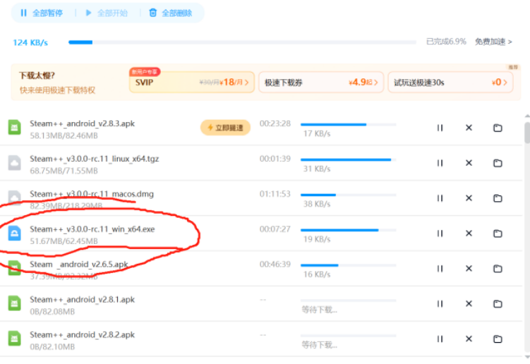
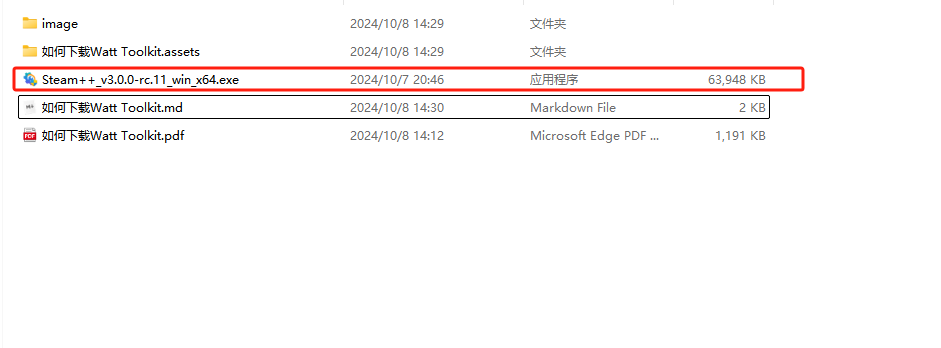
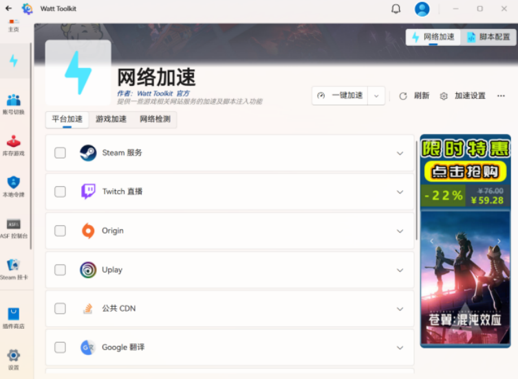
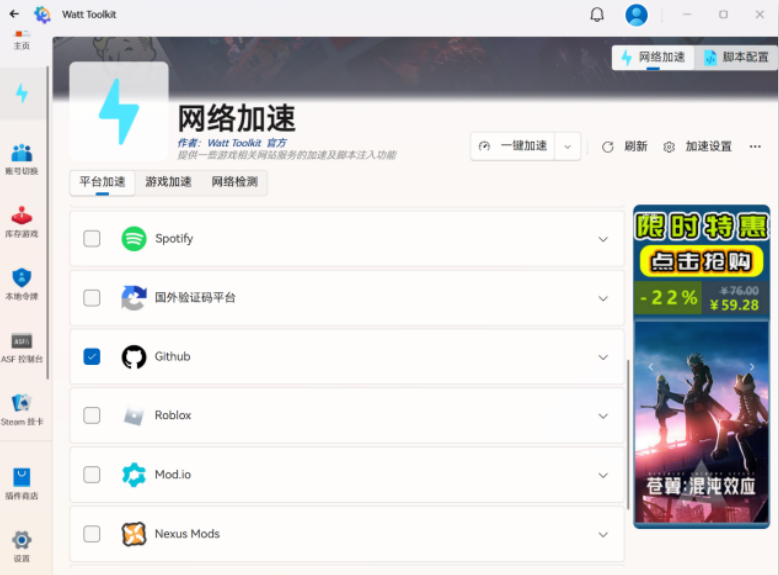
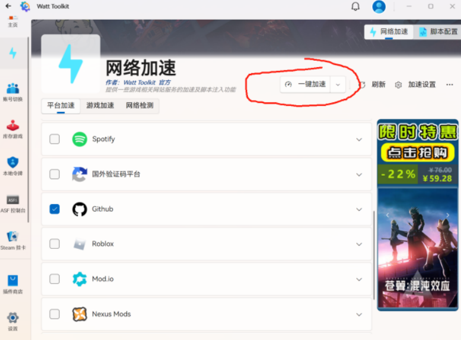

## 如何下载Watt Toolkit

**先看方法二**

### 方法一：

#### 打开链接https://steampp.net/

``

``

#### 紧接着会跳转如下界面

##### （我个人用前三个渠道下载失败，转而用百度网盘，有点是方便，缺点是慢）

#### 下载至百度网盘后，实际只要下载上面圈起来的安装包就可以

### 方法二：

 [Steam++_v3.0.0-rc.11_win_x64.exe](Steam++_v3.0.0-rc.11_win_x64.exe)

把这个github仓库下载压缩包到本地就行，里面有安装包

## 下载后如何加速应用和网站

### 以Github为例

#### 打开Watt Toolkit

#### 找到并勾选Github

#### 点击一键加速

##### （之后可能会申请获得部分权限，同意即可）

可以尝试打开网站https://github.com/signup?source=login

如果成功进入，证明加速成功
